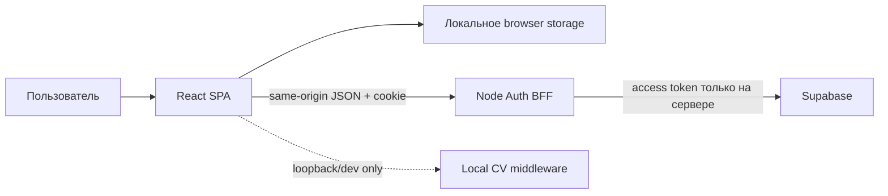

# Архитектура AS-IS

Статус: подтверждено кодом на 2026-09-09.

## Рабочий контур

- React/Vite SPA запускается локально.
- Данные pilot-контура сохраняются browser repositories; отказ хранилища обрабатывается без ложного обещания сохранения.
- Алгоритмы стилиста, onboarding, capsule, feedback и privacy покрыты детерминированными Node-тестами.
- Локальный CV middleware доступен только на loopback и выключен по умолчанию.
- Auth BFF реализует email OTP, HttpOnly cookie session и ограниченный proxy к Supabase.

## Не доказано как production

- BFF хранит сессии в памяти одного процесса: перезапуск завершает их, горизонтальное масштабирование не поддерживается.
- Cloud schema/RLS присутствуют как контракты и миграции, но live Supabase gate не выполняется в CI.
- Browser E2E gate отсутствует.
- Загрузка фото через production BFF намеренно fail-closed.
- Нет подтверждённых backup/restore, observability, incident response и production deployment.

## Границы доверия

Каноническим описанием текущей реализации является этот файл. `docs/architecture.md` описывает желаемую расширенную архитектуру и не подтверждает её наличие.
