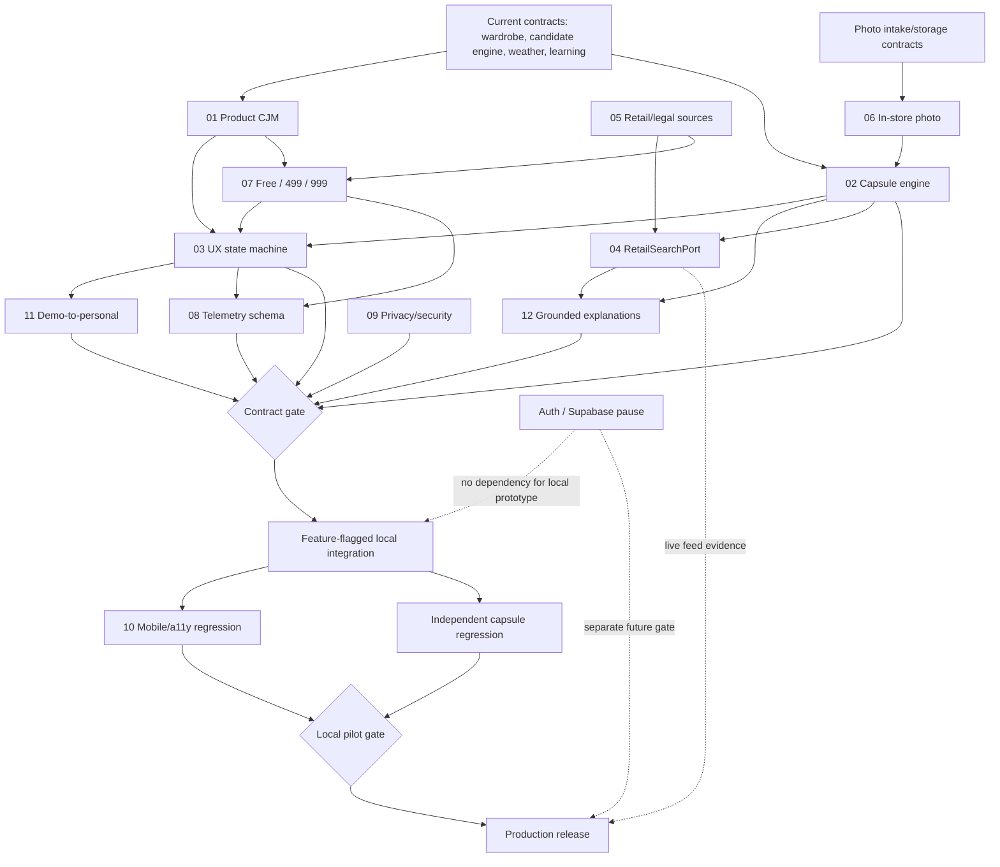

# CAPSULE-INTEGRATION-ARCH — план безопасной интеграции

Дата: 2026-08-21  
Режим: архитектурная координация, без изменения production-кода  
Scope: CAPSULE-01–12, текущий local-first runtime, photo/weather/profile/learning/telemetry, privacy, demo/personal и тарифы 499/999 ₽

## Решение

**PASS для продолжения контрактного проектирования и локального прототипа за feature flag. HOLD для слияния CAPSULE-01–12 в production runtime и для любого production-релиза.**

Причины HOLD:

- на момент сверки workstreams 01–12 выполняются параллельно, их итоговые docs/evidence ещё не являются доступным согласованным baseline;
- текущий runtime — local-first React/Vite; `docs/architecture.md` и `docs/domain-model.md` описывают будущий FastAPI/PostgreSQL/worker target, а не работающий production backend;
- auth/Supabase поставлены на паузу; их код, миграции и gate нельзя менять или считать доказанными;
- retail feed/API, лицензии изображений, актуальность цены/наличия и affiliate disclosure не подтверждены;
- production photo recognition остаётся NO-GO/HOLD; локальный photo gate не доказывает распознавание;
- тарифные entitlements 499/999 ₽ не имеют утверждённого server-owned контракта для capsule limits/features.

Допустимая ближайшая цель: **local-only, deterministic capsule prototype на подтверждённых metadata, без сетевого retail search, без paywall enforcement и без новых персональных данных**.

## 1. Фактический архитектурный baseline

| Контур | Source of truth сейчас | Статус / интеграционное правило |
|---|---|---|
| UI/navigation | `src/main.jsx`, React-компоненты | Dirty и горячая точка; менять только последним интеграционным PR после contract tests |
| Personal wardrobe/outfits/consent | `src/storageRepositories.js` | Local owner-scoped envelope; использовать repository API, не новые storage keys |
| Demo | demo catalog + onboarding first-look engine | Demo не сохранять как personal и не передавать в personal learning |
| Candidate ranking | `src/stylistCandidateEngine.js`, reasoning adapters | Только подтверждённые структурированные признаки; capsule engine должен композиционно вызывать/переиспользовать этот слой |
| Weather/context | `src/WeatherContextEditor.jsx`, `src/weatherService.js`, manual context persistence | Ручной город — основной fallback; точную геолокацию не требовать и не телеметрировать |
| Photo | `src/photoIntake.js`, `src/PhotoIntake.jsx`, `src/photoStorage.js` | Local sanitize/quality/review; отдельное consent; не трактовать как production recognition |
| Profile/preferences | local profile modules + repositories | Локальный профиль не равен authenticated identity; не обещать sync |
| Learning | `src/stylistLearning.js`, `src/stylistLearningAdapter.js` | Consent + owner + ETag + idempotency + undo; capsule feedback должен быть additive |
| Telemetry | `src/telemetry/` | Local-only, consent-gated, allowlist, zero egress/PII; новые события сначала в словарь и privacy tests |
| Privacy | `src/privacyDataController.js` | Export/reset/delete должны включать новый capsule aggregate либо честно перечислять omission |
| Auth/Supabase | `src/auth/`, `server/`, `supabase/`, auth docs | **FROZEN / OUT OF SCOPE**; не интегрировать и не менять |
| Future cloud | `docs/architecture.md`, `docs/domain-model.md` | Target seam; не заявлять как runtime evidence |

Критическое расхождение: legacy `main.jsx` остаётся composition root с прямыми связями. Capsule не должен добавлять туда business rules; только mount/controller wiring после стабилизации портов.

## 2. Реестр CAPSULE-01–12 и решения

Итоговые статусы ниже — интеграционные, а не подмена вердиктов владельцев workstreams. Пока их документы не перечитаны в завершённом виде, все интерфейсы считаются proposed.

| WS | Назначение | Выходной контракт | Зависит от | Интеграционный статус |
|---|---|---|---|---|
| 01 | Product CJM | entry/exit journeys, value promise, failure recovery | текущий demo/personal CJM, 03, 07 | PASS для design; HOLD до согласования AC |
| 02 | Capsule engine | domain types, deterministic selection, gap analysis, evidence trace | candidate engine, confirmed wardrobe, weather, learning | PASS как isolated module; HOLD runtime |
| 03 | UX spec | screens/states/copy, empty/partial/error/paywall states | 01, 02, 07, 10, 11, 12 | HOLD до state-machine review |
| 04 | Retail search | `RetailSearchPort`, normalization/ranking/fallback | 02 gap profile, 05, 09 | HOLD: внешних feeds нет |
| 05 | Retail partnerships | source/legal/license/SLA matrix | 04, 07, 09 | HOLD до owner/legal decisions |
| 06 | In-store photo | intake → review → hypothetical item → compatibility | photo contracts, 02, 09, 10 | PASS для local manual review; HOLD recognition/network |
| 07 | Monetization | Free/499/999 entitlements, affiliate disclosure, experiments | 01, 04, 05, 08 | HOLD до утверждённой entitlement matrix |
| 08 | Metrics | event dictionary additions, funnels, pilot thresholds | 01, 03, 07, telemetry/privacy | PASS для schema design; HOLD production analytics |
| 09 | Privacy/security | threat model, data inventory, consent/retention/egress gates | все data flows, особенно 04/05/06/08 | Обязательный PASS до UI integration |
| 10 | Mobile/a11y | viewport, keyboard, dialog, reflow, touch matrix | 03 and final runtime | Обязательный gate |
| 11 | Demo-to-personal | explicit state machine and non-mixing rules | 01, 03, auth pause | PASS только local/demo separation; auth transition HOLD |
| 12 | Explanations | grounded capsule/gap/purchase explanations | 02 trace, 04 evidence, learning | PASS для deterministic templates; HOLD unverifiable claims |

## 3. Dependency graph



## 4. Канонические интерфейсы между workstreams

Имена illustrative; окончательный owner CAPSULE-02 фиксирует точные schemas и version constants.

```ts
type DataMode = "demo" | "personal_local" | "personal_cloud";

type CapsuleRequestV1 = {
  ownerId: string;
  mode: DataMode;
  purpose: "daily" | "office" | "trip" | "season";
  itemLimit: number;
  requiredItemIds: string[];
  context: { weather?: ConfirmedWeather; occasion?: string; budget?: MoneyRange };
  preferenceVersion?: number;
};

type CapsuleResultV1 = {
  schemaVersion: "capsule-result-v1";
  sourceMode: DataMode;
  itemIds: string[];
  outfitCandidates: Array<{ itemIds: string[]; traceId: string }>;
  gaps: GapProfileV1[];
  coverage: { compatibleOutfitCount: number; unknownCount: number };
  limitations: string[];
  engineVersion: string;
};

type GapProfileV1 = {
  category: string;
  allowedColors?: string[];
  silhouette?: string[];
  warmth?: { min: number; max: number };
  formality?: { min: number; max: number };
  budget?: MoneyRange;
  evidenceTraceIds: string[];
};

interface CapsuleRepository {
  load(ownerId: string): RepositoryResult<CapsuleResultV1[]>;
  save(ownerId: string, value: CapsuleResultV1[], options: { idempotencyKey: string }): RepositoryResult<CapsuleResultV1[]>;
  export(): unknown;
  reset(): unknown;
  delete(): unknown;
}

interface RetailSearchPort {
  search(gap: GapProfileV1, context: { locale: "ru-RU"; currency: "RUB" }): Promise<RetailSearchResultV1>;
}

type RetailSearchResultV1 = {
  source: string;
  fetchedAt: string;
  staleAfter: string;
  items: Array<{ productId: string; url: string; price: number; currency: "RUB"; availability: "in_stock" | "unknown"; sponsored: boolean; evidence: string[] }>;
  limitations: string[];
};
```

Инварианты интерфейсов:

1. `mode` обязателен; `demo` IDs никогда не записываются в personal repository/learning.
2. Engine не получает photo bytes, filename, exact location, email, auth token или free text.
3. Любой вывод объяснения строится из versioned trace, а не заново придуманного текста.
4. Unknown metadata уменьшает coverage и порождает limitation; не подставляется фиктивное значение.
5. Retail item не становится wardrobe item без отдельного пользовательского подтверждения.
6. Affiliate/sponsored status видим до клика; коммерческий вес не может обойти compatibility hard constraints.
7. 499/999 передаются как entitlement codes/capabilities, не как условные проверки цены в UI/engine.
8. `personal_cloud` запрещён, пока auth pause не снят отдельным решением и live gates не пройдены.

## 5. Ownership файлов и конфликтные зоны

| Owner | Разрешённая зона будущей реализации | Не трогать без координации |
|---|---|---|
| CAPSULE-02 Engine | новые `src/capsule/domain.js`, `engine.js`, `engine.test.js` | `stylistCandidateEngine.js`, learning rules |
| CAPSULE-03 UX | новые capsule components/styles после approved spec | `main.jsx`, global `styles.css` до integration wave |
| CAPSULE-04/05 Retail | новые `src/capsule/retailPort.js`, adapters только после source approval | photo modules, auth/BFF, scraping |
| CAPSULE-06 Photo | composition adapter вокруг существующего PhotoIntake | `photoIntake.js`, `photoStorage.js` semantics |
| CAPSULE-07 Plans | docs/schema `capsuleEntitlements` | auth/profile metadata, hardcoded price checks |
| CAPSULE-08 Metrics | additions to event dictionary + tests после privacy review | arbitrary properties, network sender |
| CAPSULE-09 Privacy | threat model/tests/data inventory | production behavior without explicit implementation task |
| CAPSULE-10 QA | browser harness/evidence/docs | product fixes in same QA task |
| CAPSULE-11 State | pure demo/personal transition policy + tests | auth/Supabase or implicit demo persistence |
| CAPSULE-12 Explanation | trace-to-copy renderer + snapshots | direct inference from raw photo/profile |
| Integration owner | repository registration, feature flag, final mount in `main.jsx` | auth/Supabase; unrelated dirty edits |

Shared hotspots requiring one integration owner and serialized edits: `src/main.jsx`, `src/styles.css`, `src/storageRepositories.js`, `src/privacyDataController.js`, `src/telemetry/eventDictionary.js`, `package.json` and browser harnesses.

## 6. Порядок безопасной интеграции

1. **Freeze by observation:** сохранить `git status`, перечитать финальные CAPSULE-01–12 docs, regression tracker и актуальный manifest; не reset/checkout/commit.
2. **Contract reconciliation:** утвердить единый glossary, schemas/version fields, demo/personal states, entitlement capability matrix и privacy data inventory.
3. **Pure engine:** реализовать 02 + 12 как side-effect-free modules на authored fixtures; никаких UI/storage/network.
4. **Local repository boundary:** добавить отдельный capsule aggregate с export/reset/delete; миграция additive, старые данные сохраняются при любой ошибке.
5. **State policy:** реализовать 11 как pure transition table. При auth pause CTA personal cloud показывает честный HOLD/fallback, а local pilot остаётся отдельным режимом.
6. **UX under flag:** подключить 03 через `VITE_CAPSULE_LOCAL_PILOT`; default production behavior неизменен. Сначала manual confirmed wardrobe/weather; photo optional.
7. **Photo adapter:** подключить 06 только через существующий `onReady`/review contract и отдельное photo consent; hypothetical retail item хранить transient до подтверждения.
8. **Telemetry:** после PASS 09 добавить только allowlisted events; consent off = zero persisted events; local-only zero egress сохраняется.
9. **Retail stub:** deterministic authored catalog для usability, явно `demo`; real `RetailSearchPort` остаётся disabled до PASS 04/05/09.
10. **Tariff experiment:** отображать 499/999 как экспериментальные offers, не применять entitlement/paywall без утверждённой matrix и receipt/source of truth.
11. **Regression:** unit → build → privacy/photo → performance → 320/360/390/412/430/1280 browser/a11y → demo/personal negative tests.
12. **Pilot/release decision:** независимый reviewer выпускает PASS/HOLD на неизменённом candidate. Любое изменение hotspot после gate инвалидирует evidence.

## 7. Release gates и acceptance criteria

### G0 — Contract gate

PASS, если:

- финальные 01–12 docs доступны и не имеют несовместимых states/schemas;
- есть один owner на каждый shared hotspot;
- demo/personal/auth-paused transition table исчерпывающая;
- тарифы представлены capabilities для Free/499/999, а не UI-ценовыми if-statements;
- privacy owner дал PASS data inventory, retention, consent и export/delete.

Иначе HOLD.

### G1 — Engine/explanation gate

- одинаковый input/version даёт одинаковый ordered result/signature;
- используются только confirmed garment/context facts;
- required items сохраняются либо возвращается явный unsatisfied constraint;
- gaps имеют evidence trace и не утверждают fit/body/color type;
- unknowns видимы; при недостатке данных есть abstention/fallback;
- explanation snapshot полностью выводится из selected result trace;
- learning adjustment сохраняет diversity guardrail, undo и idempotency.

### G2 — Data/privacy gate

- новый aggregate owner-scoped; demo → personal write невозможен;
- quota/unavailable/corrupt storage не показывает ложный success;
- export включает capsule schema/version или явный omissions manifest;
- reset/delete удаляют capsule data и дают read-back evidence;
- фото, blob/data URLs, EXIF, filename, exact city/GPS, email/token/free text не попадают в capsule, retail query и telemetry;
- consent photo/learning/telemetry независимы и могут быть отозваны.

### G3 — UX/mobile/a11y gate

- journeys: demo capsule, insufficient wardrobe, personal-local capsule, edit constraints, retry, delete, auth-paused CTA;
- 320/360/390/412/430/1280: overflow 0; targets ≥44 px; 200% reflow; keyboard-only PASS;
- dialogs: focus trap/return, Escape, meaningful headings/live errors;
- отсутствуют dead ends; back/cancel сохраняют ранее подтверждённые данные;
- demo, local-only, unavailable retail и sponsored result обозначены явно;
- price/paywall появляется только после показанной бесплатной ценности и без dark patterns.

### G4 — Photo/in-store gate

- invalid MIME/signature/size/dimensions и person/unknown declaration fail closed;
- sanitize/review/preserve-original semantics существующего контракта не меняются;
- без photo storage consent bytes не сохраняются; без processing consent нет сети;
- local quality result не называется AI recognition;
- compatibility считается по подтверждённым пользователем attributes; фото само не создаёт факт;
- ретейл-кандидат даёт минимум три grounded сочетания либо честно сообщает, что данных недостаточно.

### G5 — Retail/commercial gate

- только разрешённые API/feed/catalog sources; scraping отсутствует;
- image/text usage license, attribution, update SLA и removal process документированы;
- цена, валюта, наличие и `fetchedAt/staleAfter` отображаются;
- redirect домены allowlisted; query не содержит personal wardrobe/item IDs;
- organic compatibility rank вычисляется до commercial tie-breaker;
- affiliate/sponsored disclosure видимо; event consent соблюдён;
- Free/499/999 entitlement matrix, refund/support и experiment success/failure thresholds утверждены владельцем.

### G6 — Regression/performance gate

- все существующие unit/integration tests и production build PASS;
- capsule golden suite PASS; ordered signatures стабильны;
- current photo corpus сохраняет false accepts=0 и bypass=0;
- privacy browser gate PASS, unexpected external egress=0 в local mode;
- p95 не ухудшается более чем на 15% относительно зафиксированного unchanged baseline и остаётся в абсолютном бюджете;
- 0 P0/P1 data-loss, privacy, demo/personal, keyboard или navigation defects.

### G7 — Pilot / release gate

Local pilot PASS допускается только после G0–G6 на одном immutable candidate и достижения thresholds, которые утвердят 01/07/08. Production остаётся HOLD, пока отдельно не доказаны live retailer, production telemetry/retention и — если потребуется personal cloud — auth/provider/RLS/session/delete. Auth не является обязательной зависимостью local capsule pilot.

## 8. Риски и зависимости

| Риск | Severity | Mitigation / owner dependency |
|---|---|---|
| 12 параллельных specs расходятся по schemas/states | P0 integration | G0 reconciliation, versioned JSON fixtures, один integration owner |
| Demo вещи/feedback попадают в personal | P0 privacy/trust | mandatory `DataMode`, negative tests, separate repository keys |
| Локальный профиль выдают за account/sync | P0 trust/data | explicit local-only copy; auth pause preserved |
| Fake fashion claims из неполных metadata | P0 product/safety | confirmed facts only, unknown/abstain, trace renderer |
| Фото трактуется как person/body analysis | P0 privacy/safety | garment-only gate, manual confirmation, forbidden-claim audit |
| Retail scraping/license/price staleness | P0 legal/trust | approved feeds only; licensing and freshness gates |
| Affiliate bias ухудшает рекомендации | P1 trust | compatibility hard constraints, disclosed commercial tie-break only |
| 499/999 обещают неподтверждённую ценность | P1 commercial | WTP pilot; capabilities matrix; no enforcement before owner approval |
| Capsule combinatorics degrade mobile/perf | P1 technical | bounded item/candidate limits, deterministic pruning, p95 budget |
| Learning creates repetitive wardrobe | P1 product | decay, undo, diversity/coverage guardrails |
| Export/delete omits capsule/photo links | P0 privacy | aggregate registration + residue read-back tests |
| Dirty shared hotspots overwrite others | P0 delivery | serialized owner, patch review, pre/post status and focused diffs |

External/owner dependencies: approved CAPSULE-01–12 outputs; tariff capability decisions; retailer/legal partner evidence; pilot sample and success thresholds; independent QA reviewer. Supabase/auth credentials are deliberately **not** a dependency for the local prototype.

## 9. Следующие задачи

1. **CAPSULE-INTEGRATE-01 — Reconcile contracts:** после завершения 01–12 собрать schemas/states/open decisions и дать точечный PASS/HOLD G0.
2. **CAPSULE-CONTRACT-TEST-02:** создать authored cross-workstream fixtures `request → result → explanation → telemetry` и negative demo/personal/privacy cases.
3. **CAPSULE-ENGINE-03:** реализовать pure deterministic engine и grounded renderer в новых изолированных файлах; без composition root.
4. **CAPSULE-DATA-04:** спроектировать additive local repository/export/reset/delete migration с failure recovery.
5. **CAPSULE-UX-05:** собрать local-only prototype под feature flag с manual wardrobe/weather и auth-paused copy.
6. **CAPSULE-QA-06:** выполнить independent mobile/a11y/privacy/performance regression на неизменённом candidate.
7. **CAPSULE-PILOT-07:** blind comparison current outfit flow vs capsule flow; измерить time-to-value, useful outfits, gap usefulness, WTP 499/999 и доверие к retail disclosure.
8. **CAPSULE-RETAIL-08:** только после pilot signal выбрать один разрешённый feed/API и провести legal/security/freshness spike без personal data.
9. **VK-ID-RESEARCH:** отдельный backlog comparison VK ID vs email OTP; не связывать с capsule release и не реализовывать до снятия auth pause.

## 10. Итог для координации

Архитектурно capsule-функция совместима с текущим проектом, если вводится как изолированный deterministic domain поверх confirmed wardrobe/context и существующих repository/privacy seams. Самый безопасный путь — local-only prototype без auth, Supabase и live retail, затем независимый pilot. Текущий интеграционный вердикт: **design PASS / runtime and production HOLD** до завершения 01–12, согласования контрактов, privacy gate и полного regression. Auth/Supabase остаются frozen; VK ID — только исследовательский backlog.
