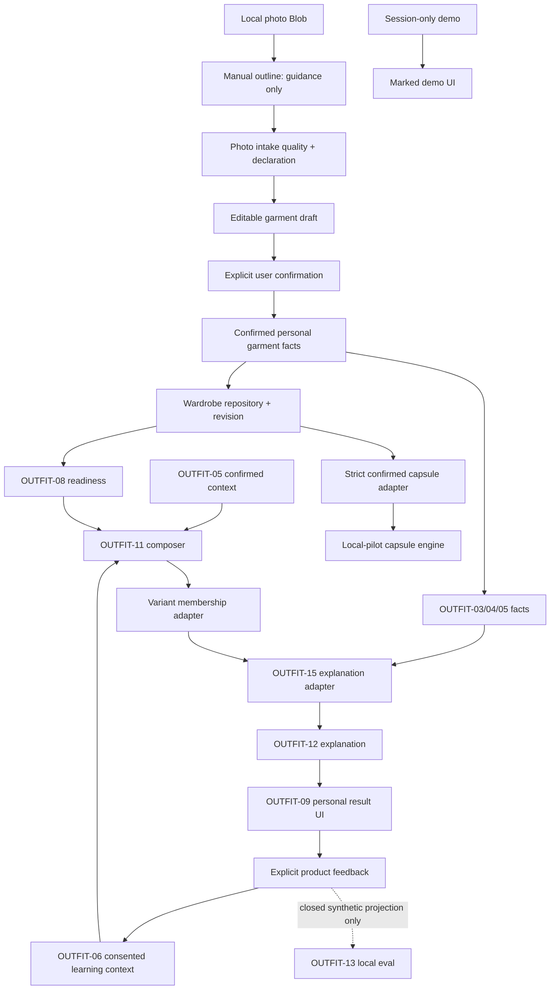

# OUTFIT-15B — финальная архитектурная сверка

Дата среза: 2026-08-21. Scope: personal wardrobe, local-first, отдельный маркированный demo. Auth, Supabase, VK ID, payments и external retail не входят в интеграцию и остаются HOLD.

## Решение

**PASS:** OUTFIT-01…10 как продуктовые/domain/UX/eval контракты; OUTFIT-12 как узкий local-only renderer подтверждённых facts; текущий проверенный personal-wardrobe contour — 350/350 tests PASS.

**HOLD:** объединённый release OUTFIT-wave. OUTFIT-11 и OUTFIT-13 не готовы к wiring без точечных контрактных исправлений; OUTFIT-14 оставляет release evidence gaps. Photo auto-recognition, cloud/auth, commerce и retail не разблокируются этим PASS.

## 1. Reconciliation OUTFIT-01…14

| Task | Фактический артефакт | Статус для интегратора |
|---|---|---|
| OUTFIT-01 | `docs/OUTFIT-01-CJM.md` | PASS contract; production HOLD. До трёх, а не обязательно три варианта; personal-only, unknown-safe, no public score. |
| OUTFIT-02 | `docs/OUTFIT-02-DOMAIN.md` | PASS domain contract; источник canonical personal outfit/session boundaries. |
| OUTFIT-03 | `docs/OUTFIT-03-COLOR.md`, `src/colorReasoning.js` | PASS isolated rules; только confirmed garment color facts. |
| OUTFIT-04 | `docs/OUTFIT-04-SILHOUETTE.md`, `src/silhouetteReasoning.js` | PASS isolated rules; no body claims, unknown-safe. |
| OUTFIT-05 | `docs/OUTFIT-05-CONTEXT.md`, context/weather modules | PASS contract, conditional runtime; live weather egress/failure остаётся HOLD. |
| OUTFIT-06 | `docs/OUTFIT-06-LEARNING.md`, learning modules/tests | PASS narrow local loop: consent, owner, ETag, idempotency, provenance, decay, append-only undo; `productionEvidence=false`. |
| OUTFIT-07 | `docs/OUTFIT-07-DIVERSITY.md`, candidate/outfit tests | PASS contract/engine evidence; runtime bounded final composer semantics. |
| OUTFIT-08 | `docs/OUTFIT-08-READINESS.md`, `src/honestReadiness.js` | PASS primitives; release HOLD до result/gap UI и browser journey. |
| OUTFIT-09 | `docs/OUTFIT-09-UX.md`, explanation/UI contracts | PASS UX specification; browser E2E ещё нужен. |
| OUTFIT-10 | `docs/OUTFIT-10-EVALS.md` | PASS specification; KPI values, public score и production analytics HOLD. |
| OUTFIT-11 | `src/outfitV2Composer.js` + tests | **HOLD narrow integration:** safe boundaries PASS, но «ровно три или ноль» конфликтует с OUTFIT-01/07/08 «до трёх; 1–2 допустимы». |
| OUTFIT-12 | `src/outfitExplanationV2.js` + tests | **PASS narrow local integration**, только через facts adapter и personal membership validation. |
| OUTFIT-13 | `src/outfitEvalV2.js`, golden/tests | **HOLD product wiring:** isolated evaluator PASS, но action/consent/preservation contract расходится с OUTFIT-06/10. Только developer-local synthetic eval. |
| OUTFIT-14 | `docs/qa/OUTFIT-14-BASELINE.md` | PASS tested local contour; release HOLD: photo calibration, byte-level EXIF/GPS, live weather и full browser journeys incomplete. |

## 2. Fixable mismatches и точные owners

### M1 — OUTFIT-11 cardinality/status

`composeOutfitV2()` возвращает `hold`, удаляет все candidates и выдаёт `three_diverse_variants_unavailable`, если найдено меньше трёх. Это нарушает OUTFIT-01/07/08: 1–2 честных полных варианта лучше нуля.

- Owner: **OUTFIT-11 — `src/outfitV2Composer.js`, `src/outfitV2Composer.test.js`**.
- Fix: 1–2 variants → canonical `limited` status + stable limitation; zero → `hold`. Не ослаблять hard constraints, anchor и diversity.

### M2 — OUTFIT-11 → OUTFIT-12 seam отсутствует

OUTFIT-11 отдаёт `{variantId,itemIds,signature,reasonCodes}`; OUTFIT-12 требует `{source,outfitId,outfitItemIds,personalWardrobeItemIds,facts}` и отдельный grounded fact allowlist.

- Owner: **OUTFIT-15 integration adapter**; allowlist остаётся у OUTFIT-12 owner.
- Fix: `variantId → outfitId`; повторная проверка membership в том же wardrobe revision; facts только из OUTFIT-03/04/05; никаких composer score/trace/free text. Composer не должен создавать explanation facts.

### M3 — OUTFIT-13 feedback vocabulary/consent

`outfitEvalV2` кодирует отрицание как `would_wear:false`, тогда как OUTFIT-06 использует `not_for_me` с обязательной reason/provenance. `outfit-eval-local-v1` не равен `stylist-learning-consent-v1`.

- Owner: **OUTFIT-13 — `src/outfitEvalV2.js`, golden/tests**.
- Fix: либо навсегда объявить модуль test-only и проецировать закрытые synthetic cases, либо создать новую versioned product-event evaluator schema с vocabulary OUTFIT-06. Consent scopes не объединять.

### M4 — OUTFIT-13 replacement preservation

Evaluator проверяет membership target/replacement, но не same slot/category, неизменность остальных item IDs, anchor, context и hard constraints. Request не доказывает acceptance.

- Owner: **OUTFIT-13 evaluator**, preservation interface предоставляет **OUTFIT-11 replacement/composer owner**.
- Fix: before/after snapshots + canonical preservation result; changed slot/category, unchanged non-target set, anchor/hard constraints; acceptance отдельным explicit event.

### M5 — manual garment outline не является trusted fact

Артефакты: `src/garmentSelection.js`, `src/GarmentOutlineSelector.jsx`, `src/photoIntake.js`, `src/PhotoIntake.jsx`.

Подтверждено: explicit local action, ≥3 points, normalized contract, Blob URL revoke, selection required before photo decision, no transport. Но non-finite coordinates, zero-area/self-intersecting polygon и letterbox clicks при `object-fit:contain` не отвергаются; controller проверяет лишь source/array/length; keyboard drawing alternative отсутствует.

- Owner: **photo/manual-outline owner — перечисленные modules/tests**.
- Fix: finite/bounded points, minimum area, image-content bounds, degenerate polygon rejection в controller, accessible manual fallback.
- До фикса outline — только UI guidance, не segmentation/classification/confirmed garment evidence.

### M6 — capsule adapter default-positive

`src/capsuleAppAdapter.js` ставит mapped garments `confirmed:true`, `status:"ready"` и теряет per-field confirmation.

- Owner: **capsule adapter owner — `src/capsuleAppAdapter.js`, `src/capsuleContracts.test.js`**.
- Fix: общий confirmed-personal-garment adapter с OUTFIT-11; unknown/unconfirmed остаются unready/excluded с честной reason. Capsule только loopback/local pilot.

## 3. Interfaces и ownership

| Boundary | Input → output | Owner | Invariant |
|---|---|---|---|
| Photo selection | local Blob + manual input → `manual-outline-v1` | photo/manual-outline | local-only; outline не recognition truth |
| Photo intake | file + outline + declaration → review/retake | photo intake | unknown/person/critical quality fail closed; no network |
| Garment confirmation | editable draft → confirmed personal facts | wardrobe/profile | per-field confirmation/provenance; no body inference |
| Readiness | wardrobe snapshot → ready/limited/gaps | OUTFIT-08 | demo/unknown/unready не удовлетворяют readiness |
| Context | explicit confirmed context → allowlisted facts | OUTFIT-05 | skip/stale/unknown не становятся match |
| Composition | scoped wardrobe + anchor/constraints → 1–3 variants | OUTFIT-11 | owner/membership, hard gates, deterministic diversity, no public score |
| Explanation adapter | variant + same revision + confirmed facts → OUTFIT-12 request | OUTFIT-15 | membership recheck; no free text/internal trace |
| Explanation | grounded request → qualitative sections | OUTFIT-12 | allowlist, neutral unknown, no body/public score |
| Learning | explicit action + reason/provenance/consent → reversible event | OUTFIT-06 | ETag/idempotency/owner/undo/decay |
| Evaluation | frozen synthetic case → local pass/fail | OUTFIT-13/10 | eval consent separate; no telemetry/PII |
| Persistence | aggregate → read-back/receipt | repository owner | memory-first не durable success |
| Release | frozen candidate → test/build/browser/privacy/perf | OUTFIT-14 | product changes invalidate evidence |

`src/main.jsx` — только composition root, не owner validation, facts, ranking, learning или persistence rules.

## 4. Dependency graph

Forbidden edges: demo → personal wardrobe/history/learning/eval; outline/photo bytes → ranking/telemetry; eval consent → learning; internal score/trace → UI; unknown/unconfirmed → positive fact; local receipt → cloud/account claim.

## 5. Safe narrow integration order

1. Freeze file manifest и OUTFIT-14 evidence; product patch требует rerun.
2. Закрыть M5 или явно оставить outline guidance-only.
3. Freeze confirmed personal garment adapter + wardrobe revision; negative tests для demo/cross-owner/unconfirmed.
4. Закрыть M1: 0→hold, 1–2→limited, 3→ready.
5. Включить OUTFIT-11 local feature seam; не запускать два writers и не смешивать scores с legacy engine.
6. Добавить M2 adapter и подключить OUTFIT-12 read-only — это единственная одобренная сейчас narrow integration.
7. Подключить OUTFIT-06 отдельно, со своим consent/receipt/undo; UI action не равен learning.
8. Держать OUTFIT-13 developer-local до M3/M4; без raw product payload/profile writes.
9. Закрыть M6 до capsule request из personal wardrobe; capsule остаётся local-pilot.
10. Unit/contracts, build, full browser journey, 320/360/390/412/430/1280, privacy/photo/performance/rollback; новый OUTFIT-14 baseline.

## 6. Release gates

| Gate | PASS | HOLD / rollback |
|---|---|---|
| R1 scope | same personal owner/revision для всех items | demo/foreign/deleted/unknown item |
| R2 readiness | 1–3 complete variants; zero honest hold | 1–2 discarded или quota padded |
| R3 facts | only confirmed fields satisfy constraints | default-positive unknown |
| R4 explanation | only grounded allowlisted facts | composer text/score becomes claim |
| R5 learning | separate consent, owner, ETag, idempotency, provenance, undo/decay | eval consent reused/permanent click |
| R6 eval | synthetic closed cases + preservation/action alignment | raw personal payload; request=acceptance |
| R7 photo/privacy | valid outline, no egress, consent/delete, EXIF/GPS byte proof | invalid geometry or data leakage |
| R8 public DTO | closed/versioned, no score/weight/utility/percent/trace | internal ranking leakage |
| R9 persistence | success after read-back/receipt; rollback tested | memory fallback shown saved |
| R10 UX/browser | full goal/anchor→variants→explanation→feedback journey | module/unit-only proof |
| R11 performance | approved budgets + stable signatures | regression/nondeterminism |
| R12 forbidden scope | auth/Supabase/VK ID/payments/retail unchanged | any such wiring |

## 7. Rollback

Rollback — forward patch/feature seam; no reset/checkout и no unrelated deletion.

1. Disable OUTFIT-11 seam → honest readiness, никогда personal→demo fallback.
2. Disable OUTFIT-12 adapter независимо → neutral explanation unavailable, variants сохраняются.
3. Перестать передавать learning context или append owner-scoped undo/reset; audit events не переписывать.
4. OUTFIT-13 не имеет product writer; отключить harness без изменения feedback/profile data.
5. Photo/outline failure: очистить temporary selection, revoke URL; original local photo хранить до explicit delete. Migration rollback — copy-first + verified receipts.
6. Schema rollback: additive dual reader раньше смены writer; future unknown data не downgrade.
7. Capsule seam → disabled local-pilot; HOLD не превращать в retail suggestion.
8. Повторить affected gate + full test/build/browser; выпустить новый baseline.

## 8. Integrator brief

- **Integrate now narrowly:** OUTFIT-12 read-only через membership + confirmed-facts adapter.
- **Fix then integrate:** OUTFIT-11 cardinality/status M1.
- **Keep test-only:** OUTFIT-13 до M3/M4.
- **Manual outline:** local UX guidance, не trusted evidence до M5.
- **Capsule:** local-pilot only; M6 до personal wiring.
- **Release:** HOLD до R1–R12 и нового OUTFIT-14 на frozen candidate.

Итог: **PASS для narrow local integration OUTFIT-12; conditional PASS для OUTFIT-11 после M1; HOLD для product wiring OUTFIT-13 и общий release.**
