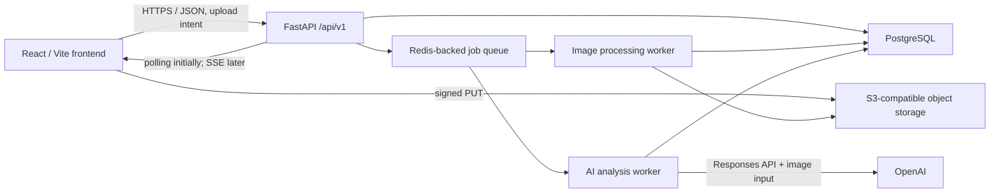
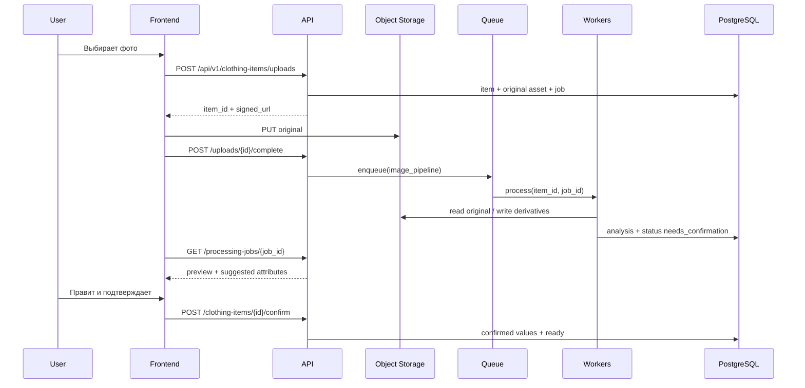

# Архитектура AI-стилиста

Статус: утверждённый контракт Этапа 0  
Версия: 1.0  
Дата: 2026-07-26

## Цели

- Не терять оригинальные фотографии и пользовательские данные.
- Выполнять тяжёлую обработку асинхронно и восстанавливаемо.
- Не раскрывать OpenAI API key во frontend.
- Не публиковать очищенное фото и AI-атрибуты без подтверждения пользователя.
- Позволить независимо развивать frontend, API и workers через версионированные контракты.

## Контекстная схема



## Ответственность компонентов

### Frontend

- Получает upload intent и загружает файл по подписанному URL.
- Показывает статус обработки и повторяет только безопасные GET-запросы.
- Показывает оригинал и обработанную версию рядом.
- Позволяет исправить crop и любые AI-поля.
- Отправляет явное подтверждение; до него вещь не участвует в подборе.
- Не хранит секреты и не обращается к OpenAI напрямую.

### API

- Аутентифицирует пользователя и проверяет владение ресурсами.
- Создаёт `ClothingItem`, `ImageAsset` и `ProcessingJob` в одной транзакции.
- Выдаёт короткоживущие подписанные URL.
- Валидирует команды и переходы состояний.
- Публикует jobs в очередь через transactional outbox.
- Возвращает только DTO `/api/v1`, не ORM-модели.

### Очередь

- Минимальная реализация: Redis + RQ/Dramatiq; выбор фиксируется в Этапе 1.
- Доставка at-least-once, поэтому каждый обработчик идемпотентен.
- Job содержит только ID ресурсов, но не бинарные изображения.
- Повторы: максимум 3 с exponential backoff; ошибки валидации не повторяются.
- Dead-letter состояние представлено `ProcessingJob.status = dead_letter`.

### Image processing worker

- Проверяет MIME по содержимому, размер, разрешение и EXIF.
- Сохраняет оригинал неизменным.
- Выполняет детерминированную сегментацию, crop и нормализацию.
- Создаёт `cutout_png`, `normalized_webp`, `thumbnail_webp` как новые `ImageAsset`.
- Не использует генеративную перерисовку одежды.
- Переводит вещь в `needs_confirmation`, но не в `ready`.

### AI analysis worker

- Получает оригинал и нормализованное изображение по внутреннему URL.
- Вызывает OpenAI Responses API только с backend.
- Требует ответ по `ClothingItemAnalysis` JSON Schema.
- Сохраняет сырой ответ отдельно от нормализованных атрибутов.
- Не перезаписывает подтверждённые пользователем значения.
- Передаёт privacy-preserving `safety_identifier`.

### PostgreSQL

- Источник истины для пользователей, вещей, jobs, образов и feedback.
- UUIDv7/UUID для публичных ID; все timestamps в UTC.
- Soft delete для пользовательских сущностей; физическое удаление отдельным privacy-job.
- Optimistic locking через `version` для редактируемых агрегатов.

### Object storage

- Приватные buckets; публичных ACL нет.
- Ключи не содержат email или ФИО: `users/{user_id}/items/{item_id}/{asset_id}`.
- Оригиналы immutable; производные версии создаются под новым `asset_id`.
- Доступ frontend только через короткоживущие signed URLs.

## Основной сценарий загрузки



## Состояния и переходы

```text
draft → uploading → uploaded → processing → needs_confirmation → ready
                                  ├────────→ failed → processing
                                  └────────→ dead_letter
needs_confirmation → processing   (повторная очистка)
ready → archived → deleted
```

Запрещено:

- `uploaded → ready` без pipeline и подтверждения;
- изменять original asset;
- подтверждать чужую вещь;
- повторно выполнять завершённый job с тем же idempotency key.

## API-контракт первой версии

| Метод | Endpoint | Назначение |
|---|---|---|
| POST | `/api/v1/clothing-items/uploads` | Создать item, asset и signed upload |
| POST | `/api/v1/clothing-items/{id}/uploads/{asset_id}/complete` | Подтвердить загрузку и поставить job |
| GET | `/api/v1/processing-jobs/{id}` | Статус и безопасная ошибка |
| GET | `/api/v1/clothing-items/{id}/review` | Оригинал, cutout и AI-поля |
| PATCH | `/api/v1/clothing-items/{id}/review` | Сохранить ручные исправления |
| POST | `/api/v1/clothing-items/{id}/confirm` | Подтвердить и перевести в ready |
| POST | `/api/v1/clothing-items/{id}/reprocess` | Создать новый job |
| GET | `/api/v1/clothing-items` | Гардероб пользователя |
| POST | `/api/v1/outfits/generate` | Сформировать кандидатов |
| POST | `/api/v1/outfits/{id}/snapshot` | Сохранить неизменяемый образ |
| POST | `/api/v1/feedback-events` | Записать продуктовый сигнал |

Все команды принимают `Idempotency-Key`. Ошибки соответствуют Problem Details (`application/problem+json`) и содержат `request_id`, но не внутренний stack trace.

## Надёжность и безопасность

- Транзакционный outbox исключает потерю job между БД и очередью.
- SHA-256 помогает обнаруживать повторные загрузки, но не используется как публичный ID.
- В логах запрещены бинарные фото, signed URLs, токены и сырой OpenAI payload.
- Внешние вызовы имеют timeout, ограниченные retries и circuit breaker.
- Удаление пользователя запускает каскадный privacy-job для БД, storage и provider metadata.
- Backup PostgreSQL и versioning storage проверяются восстановлением, а не только созданием копий.

## Нефункциональные цели первой beta

- API availability: 99.5%.
- Успешное завершение pipeline: ≥90% всех валидных загрузок.
- p95 создания upload intent: <500 мс.
- p95 полной фоновой обработки: целевое значение фиксируется после eval, начальная граница 60 секунд.
- Оригинал сохраняется в 100% принятых загрузок.
- Никакой обработанный asset не становится активным без `confirmed_at`.

