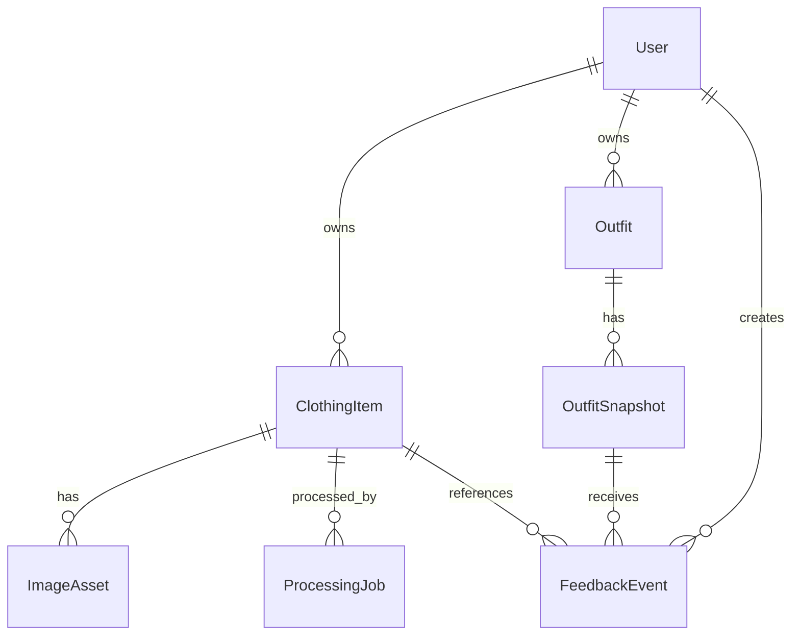

# Доменная модель AI-стилиста

Статус: утверждённый контракт Этапа 0  
Версия: 1.0  
Дата: 2026-07-26

## Общие правила

- Идентификаторы: UUID; внешние ID не содержат персональных данных.
- Время: UTC `timestamptz`; frontend локализует отображение.
- Все редактируемые агрегаты содержат `version` для optimistic locking.
- `created_at`, `updated_at`, `deleted_at` присутствуют там, где применимо.
- Пользовательские сущности удаляются soft-delete, затем privacy-job физически удаляет данные.
- AI suggestion и user-confirmed values хранятся раздельно.
- Сохранённый образ является снимком и не зависит от дальнейших изменений гардероба.

## Связи

## User

Агрегат владельца данных.

| Поле | Тип | Ограничение |
|---|---|---|
| `id` | UUID | PK |
| `email` | citext/null | unique; допускается provider-only auth |
| `display_name` | varchar(80)/null | не передаётся AI без необходимости |
| `timezone` | varchar(64) | IANA timezone |
| `locale` | varchar(10) | default `ru-RU` |
| `auth_provider` | varchar(30) | local/vk/other |
| `auth_subject` | varchar(255) | unique with provider |
| `consent_version` | varchar(20)/null | версия согласия |
| `consented_at` | timestamptz/null | обязательна до фотообработки |
| `status` | enum | active, suspended, deletion_pending, deleted |
| `created_at`, `updated_at`, `deleted_at` | timestamptz | audit lifecycle |

Инварианты: пользователь видит только собственные ресурсы; `deletion_pending` запрещает новые jobs.

## ClothingItem

Агрегат вещи, включая подтверждённые характеристики.

| Поле | Тип | Ограничение |
|---|---|---|
| `id`, `user_id` | UUID | PK, FK User |
| `status` | enum | draft, uploading, uploaded, processing, needs_confirmation, ready, archived, deleted |
| `display_name` | varchar(120) | обязательна в ready |
| `category` | enum | соответствует schema category |
| `subcategory` | varchar(80) | нормализованный slug |
| `colors` | jsonb | подтверждённая палитра |
| `style_tags`, `seasons`, `occasions` | text[] | подтверждённые значения |
| `formality`, `warmth` | smallint | 1..5 |
| `material`, `pattern`, `silhouette`, `length` | enum | подтверждённые значения |
| `ai_analysis` | jsonb/null | валидный ClothingItemAnalysis |
| `ai_model`, `ai_prompt_version`, `schema_version` | varchar | воспроизводимость |
| `confirmed_at` | timestamptz/null | обязателен для ready |
| `version` | integer | optimistic locking |

Инварианты: `ready` требует confirmed fields и approved image asset; AI не перезаписывает подтверждённые поля.

## ImageAsset

Метаданные бинарного объекта; сами байты находятся в object storage.

| Поле | Тип | Ограничение |
|---|---|---|
| `id`, `user_id`, `clothing_item_id` | UUID | PK/FK |
| `kind` | enum | original, cutout_png, normalized_webp, thumbnail_webp, outfit_snapshot |
| `storage_bucket`, `storage_key` | varchar | unique pair; private |
| `mime_type` | varchar(100) | проверяется по содержимому |
| `byte_size`, `width`, `height` | bigint/int | server-verified |
| `sha256` | char(64) | integrity/dedup hint |
| `processing_version` | varchar(30)/null | версия CV pipeline |
| `parent_asset_id` | UUID/null | производная от asset |
| `status` | enum | pending_upload, available, rejected, deleted |
| `approved_at` | timestamptz/null | пользователь подтвердил производную версию |

Инварианты: original immutable; storage key не переиспользуется; активная карточка ссылается только на available/approved asset.

## ProcessingJob

Наблюдаемая единица фоновой работы.

| Поле | Тип | Ограничение |
|---|---|---|
| `id`, `user_id`, `clothing_item_id` | UUID | PK/FK |
| `job_type` | enum | validate_upload, image_pipeline, ai_analysis, full_pipeline, privacy_delete |
| `status` | enum | queued, running, succeeded, failed, dead_letter, cancelled |
| `idempotency_key` | varchar(100) | unique per user/job type |
| `attempt`, `max_attempts` | smallint | default max 3 |
| `progress` | smallint | 0..100, информативно |
| `input_asset_id`, `output_asset_ids` | UUID/jsonb | ссылки на assets |
| `error_code` | varchar(80)/null | безопасный стабильный код |
| `error_detail_private` | text/null | только internal logs/admin |
| `provider_request_id` | varchar/null | трассировка без payload |
| `started_at`, `finished_at`, `next_retry_at` | timestamptz/null | lifecycle |

Инварианты: succeeded job не выполняется повторно; повтор создаёт attempt или новый job с новым key по явной команде.

## Outfit

Изменяемый кандидат или сохранённый пользователем логический образ.

| Поле | Тип | Ограничение |
|---|---|---|
| `id`, `user_id` | UUID | PK/FK |
| `purpose`, `weather_context`, `preference_context` | jsonb | входные условия |
| `item_ids` | UUID[] | текущий состав |
| `ranking_level` | enum | excellent, good, needs_change |
| `score_breakdown` | jsonb | объяснимые компоненты без ложного процента |
| `explanation` | text | пользовательский текст |
| `generator_version` | varchar | версия rule engine |
| `status` | enum | candidate, saved, worn, archived |
| `worn_at` | timestamptz/null | сигнал «Надела сегодня» |

Инварианты: candidate может меняться; saved/worn всегда имеет минимум один OutfitSnapshot.

## OutfitSnapshot

Неизменяемый снимок образа в момент сохранения.

| Поле | Тип | Ограничение |
|---|---|---|
| `id`, `outfit_id`, `user_id` | UUID | PK/FK |
| `sequence` | integer | unique per outfit |
| `items` | jsonb | id, name, confirmed attributes and asset reference at save time |
| `composition_asset_id` | UUID/null | неизменяемый flat-lay |
| `purpose_snapshot`, `weather_snapshot` | jsonb | контекст момента |
| `explanation_snapshot` | text | неизменяемое объяснение |
| `created_at` | timestamptz | timestamp snapshot |

Инварианты: snapshot не обновляется и не удаляется каскадно при удалении ClothingItem; ссылки на визуалы удерживаются до удаления snapshot/user.

## FeedbackEvent

Append-only продуктовый сигнал.

| Поле | Тип | Ограничение |
|---|---|---|
| `id`, `user_id` | UUID | PK/FK |
| `event_type` | enum | liked, disliked, saved, removed_from_favorites, worn, item_replaced, correction_submitted |
| `outfit_id`, `outfit_snapshot_id`, `clothing_item_id` | UUID/null | хотя бы одна цель по типу события |
| `reason_code` | enum/null | boring, too_bright, uncomfortable, wrong_style, wrong_weather, wrong_context, other |
| `metadata` | jsonb | allowlisted payload only |
| `occurred_at` | timestamptz | client event time |
| `received_at` | timestamptz | server time |
| `client_event_id` | UUID | unique per user; offline dedup |

Инварианты: события не редактируются; исправление создаёт новое событие; metadata не содержит свободных секретов или изображений.

## Индексы и ограничения

- Все FK-колонки индексируются.
- Частичный индекс ClothingItem `(user_id, status) WHERE deleted_at IS NULL`.
- ProcessingJob `(status, next_retry_at)` для worker pickup.
- FeedbackEvent `(user_id, occurred_at DESC)` и unique `(user_id, client_event_id)`.
- OutfitSnapshot unique `(outfit_id, sequence)`.
- ImageAsset unique `(storage_bucket, storage_key)` и индекс `(clothing_item_id, kind, status)`.

## Границы агрегатов

- `ClothingItem` управляет подтверждением, но не физически хранит бинарные данные.
- `ProcessingJob` меняет item через доменные команды, а не прямые произвольные SQL updates.
- `OutfitSnapshot` отделён от `Outfit`, чтобы история переживала изменение и удаление вещей.
- `FeedbackEvent` append-only и не является текущим состоянием избранного; текущее состояние вычисляется/проецируется отдельно.

